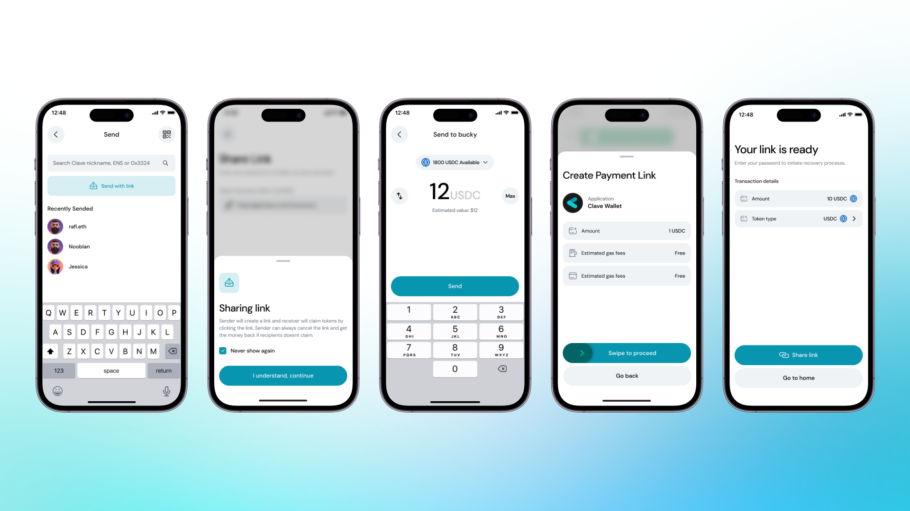

Clave, ödeme linklerini kullanarak kelimenin tam anlamıyla herkese para gönderme imkanı sunan yeni bir yöntem tanıtıyor. Bu, [Peanut Protokolü](https://peanut.to/?ref=blog2.getclave.io) ile çalıştığımız entegrasyonumuz sayesinde mümkün hale geliyor.

<iframe width="560" height="315" src="https://www.youtube.com/embed/Ugjrm0qnMmc" frameborder="0" allow="accelerometer; autoplay; clipboard-write; encrypted-media; gyroscope; picture-in-picture" allowfullscreen></iframe>

*Baki, Ulaş'a para göndermek için adresini bilmek zorunda değil!*

Ödeme linkleri, alıcının adresini bilmeye gerek kalmadan, herhangi bir mesajlaşma platformu (WhatsApp, Telegram veya Instagram gibi) üzerinden para göndermenizi sağlar. Bu yöntem, alıcının hesap bilgilerini bilme gereğini ortadan kaldırır ve en güzel yanı, alıcının önceden bir Clave hesabına sahip olmasına bile gerek olmamasıdır. Bu, [Peanut Protokolü](https://twitter.com/PeanutProtocol?ref=blog2.getclave.io) altyapısı sayesinde mümkün hale gelir.

Ödeme linki oluşturmak için şu adımları izlemelisiniz:

1. **Clave uygulamasını açın** ve ana ekrana gidin.
2. Para gönderme işlemini başlatmak için **"Gönder"** butonuna tıklayın.
3. Mevcut seçeneklerden **"Linkle Gönder"** seçeneğini seçin.
4. Göndermek istediğiniz **kripto miktarını girin.** Sağlanan listeden kripto para türünü seçebilirsiniz.
5. **Detayları onaylayın** ve devam etmek için kaydırın ve biyometrik kimlik doğrulamasını tamamlayın.
6. **Ödeme linkiniz artık hazır.** Bu linki WhatsApp, Telegram veya Instagram gibi herhangi bir mesajlaşma platformu aracılığıyla paylaşabilirsiniz.

*Linklerle Gönderim işlemi Clave içinde böyle görünür*

Linki gönderin, alıcı birkaç basit adımla fonları talep edebilir.

### **Ödeme linkleri, kelimenin tam anlamıyla HERKESE para göndermenin esnekliğini sunar!**

Göndermek istediğiniz kripto para birimini seçebilir, miktarı girebilir ve onaylamak için kaydırabilirsiniz.

Voilà! Sihirli linkiniz birinin gününü güzelleştirmeye hazır. Ayrıca, Hub'da "Linkler" bölümünde talep edilmemiş linklerinizi bulabilirsiniz.

**Şimdi, [Clave hesabınızı alın](https://blog.getclave.io/getclave.io/download) ve linklerle herkese para göndermeye başlayın!**