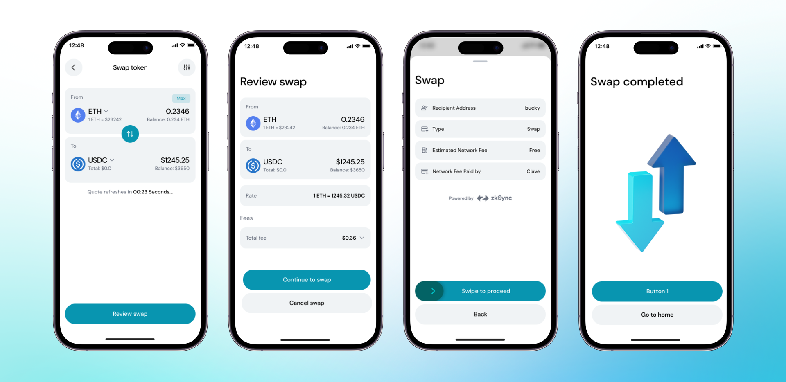

Fonlarınızın tam kontrolü sizdeyken sadece birkaç tıklama ile herhangi bir kriptoyu başka bir kriptoya kolayca takas edebilirsiniz. USDC, USDT, DAI veya ZKsync Era üzerindeki herhangi bir token ile ETH, BTC ve diğer birçok kriptoyu satın alabilirsiniz. İşlem yaparken herhangi bir ağ ücreti görmezsiniz, bu nedenle DeFi'nin sınırlarını *ücretsiz* bir şekilde keşfedebilirsiniz.

Şu anda size en iyi fiyat ve rota için ekosistemin en iyi toplayıcılarından biri olan [Odos Protokolü](https://app.odos.xyz/?ref=blog2.getclave.io)'nü kullanıyoruz. Gelecekte daha fazla seçenek ekleyeceğiz.

Tokenlerinizi takas etmek için şu adımları izlemelisiniz:

1. **Clave uygulamasını açın** ve ana ekrana gidin.
2. **"Takas"** butonuna tıklayarak bir kripto parayı başka bir kripto paraya dönüştürme işlemini başlatın.
3. **Takas etmek istediğiniz kripto parayı seçin**: "From" bölümüne tıklayın ve istediğiniz tokeni seçin (örneğin, ETH).
4. **Takas etmek istediğiniz kripto parayı seçin**: "To" bölümüne tıklayın ve istediğiniz tokeni seçin (örneğin, USDC).
5. **Takas etmek istediğiniz kripto miktarını girin.** Hedef kripto paranın karşılığı otomatik olarak hesaplanacak ve görüntülenecektir.
6. **"Takası Gözden Geçir"** butonuna tıklayarak bir sonraki adıma geçin.
7. **Takas detaylarını onaylayın** ve işlemi tamamlamak için kaydırın. Clave, bu takasları gerçekleştirmek için ZKsync kullanır, bu da hızlı ve güvenli işlemlerle sıfır ücret anlamına gelir.

Artık Clave'in yerleşik Takas fonksiyonunu kullanarak herhangi bir kriptoyu takas edebilirsiniz.