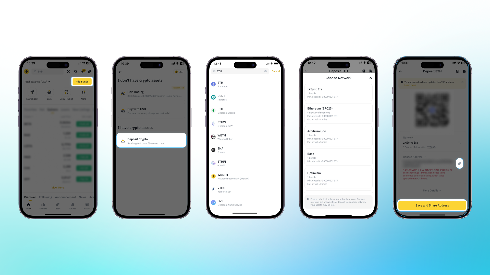
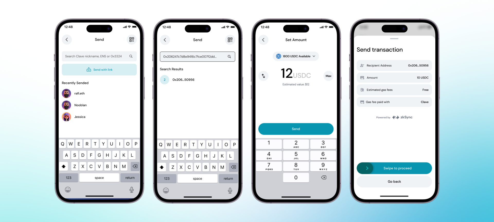

Varlıklarınızı Merkezi Borsalara (CEX'ler) veya diğer cüzdanlara nasıl çekeceğinizi öğrenin.

1. Cüzdanınızdan çekmek istediğiniz **tokeni seçin.**

2. Zincir bölümünde **"ZKsync Era"** seçeneğini seçin ve adresi kopyalayın.

3. **Clave Uygulamasını Açın**

4. Clave uygulaması içinde **"Gönder" butonuna tıklayın** ve kopyaladığınız alıcı adresini yapıştırın.

5. **Çekmek istediğiniz token miktarını girin.**

6. **Biyometrik Kimlik Doğrulamayı Tamamlayın**

Her şey tamam! Fonlarınızı başarıyla çektiniz.