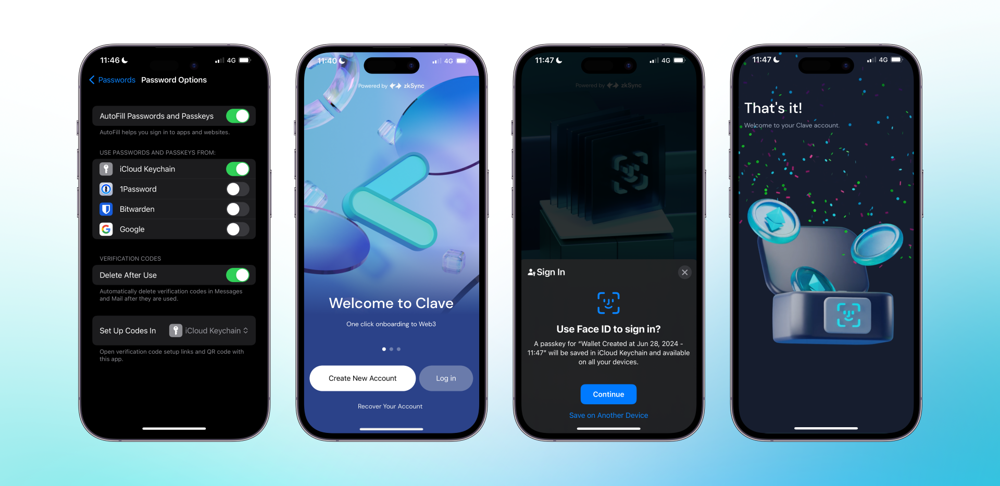

iOS cihazınızda iCloud Anahtar Zinciri kullanıyorsanız, ayarlarınızda parola hesabını önce etkinleştirmeniz gerekir.

1. **Ayarlar -> Parolalar -> Parola Seçenekleri**'ne gidin -> “Otomatik Doldur Parolalar ve Passkey'ler” seçeneğini etkinleştirin -> **iCloud Anahtar Zinciri**'ni seçin.
2. **Clave uygulamasını** açın.
3. **“Yeni hesap oluştur”** butonuna tıklayın.
4. **“Passkey oluştur”** pop-up penceresini göreceksiniz.
5. **Devam** butonuna tıklayın, ve Clave hesabınızı oluşturdunuz!

