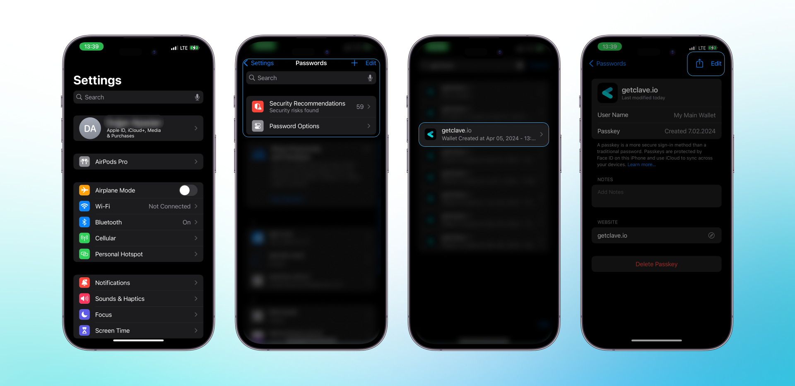

Clave uygulamasında Passkey'inizi yeniden adlandırmak, kimlik bilgilerinizi özelleştirmenize ve daha kolay erişim ve yönetim için düzenlemenize olanak tanır. Passkey'inizi yeniden adlandırmak için aşağıdaki adımları izleyin:

1. iOS cihazınızda **Ayarlar**'ı açın.
2. **Parolalar** bölümüne gidin.
3. Parolalar menüsünde, **getclave.io**'yu bulun ve üzerine dokunun.
4. Sağ üst köşedeki **Düzenle** butonuna dokunun.
5. **Kullanıcı Adı** alanını tercih ettiğiniz isimle (örneğin, "Ana Cüzdanım") değiştirin.
6. Değişiklikleri kaydetmek için **Bitti** butonuna dokunun.

Artık Passkey'inizi nasıl yeniden adlandıracağınızı bildiğinize göre, Clave kimlik bilgilerinizi düzenli ve kolayca erişilebilir tutabilirsiniz.

