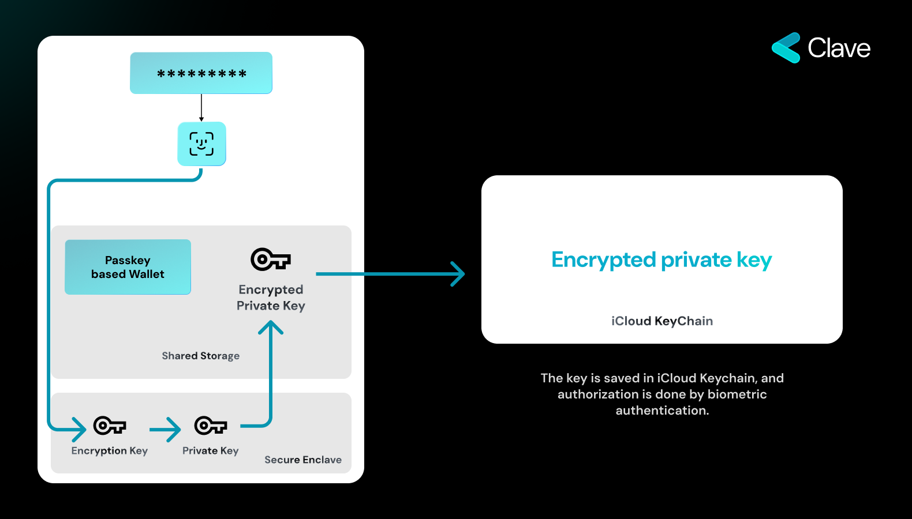
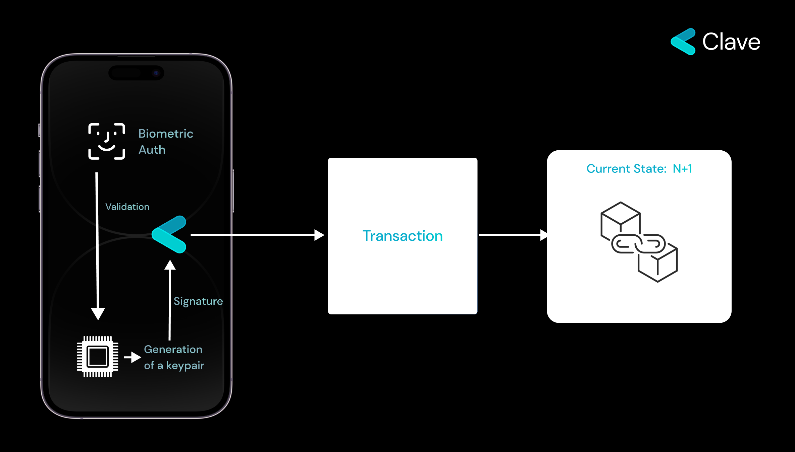

Web3'ün merkezi aracılar yerine matematiğe güvenen doğasının merkezinde Eliptik Eğri Kriptografisi (ECC) yer alır. Basit bir ifadeyle, ECC, kullanıcıların kimliklerini bir aracıya ihtiyaç duymadan kanıtlamalarına olanak tanır. Daha kısa kodlar kullanarak güçlü bir güvenlik sağlar, bu da onu Web3'ün merkeziyetsiz platformları için ideal kılar. Web3 ortamında ECC'nin en belirgin tezahürlerinden biri, kullanıcının hesabına erişmek için sıklıkla gerekli olan 12 kelimelik anahtar kelimelerdir. Web2 ekosisteminde görüldüğü gibi geleneksel kullanıcı adı-parola kombinasyonuna güvenmek yerine, Web3 kullanıcılarına benzersiz bir 12 kelimelik dizi sağlanır. Bu kelimeler, kriptografik anahtarlarından türetilir ve dijital cüzdanlarına veya hesaplarına bir parola olarak hizmet eder. Bu durum, kullanıcıların sahipliklerini kanıtlama şeklini devrim niteliğinde değiştirir ve Web2'de yaygın olan merkezi varlıklara bağımlılığı ortadan kaldırır.

Ancak bu yenilik, zorlukları beraberinde getirmez. Bu 12 kelimeyi koruma sorumluluğu tamamen kullanıcıya aittir. Web2 sisteminde bir parolayı unutmaktan farklı olarak, burada bir hesap kurtarma işlemi bir tıklama uzakta olmayabilir; Web3 ekosisteminde 12 kelimelik ifadenin kaybedilmesi, dijital varlıklara ve kimliğe kalıcı olarak erişim kaybı anlamına gelebilir. Bu kritik sorumluluk, kullanıcı verilerini merkezi ihlallerden korurken, Web3'ün ana akım tarafından benimsenmesi önünde önemli bir engel oluşturur. Kullanıcı davranışında ve anlayışında bir paradigma değişikliği gerektirir, çünkü burada risk, bir parolanın kaybedilmesinden çok daha büyüktür.

## Passkey
Web3 dijital manzarayı yeniden şekillendirirken, merkeziyetsiz ve güvenilmez işlemler sunarken, artan güvenlik önlemlerine olan ihtiyaç da ortaya çıkmaktadır. İşte bu noktada donanım imzalama kavramı devreye girer ve dijital kimlik doğrulamasını yeni bir seviyeye taşımayı vaat eder.

Peki, donanım imzalama nedir? Temel olarak, donanım imzalama, bir cihazın Secure Enclave gibi özel mikroçiplerini kullanarak kullanıcının kimliğini kanıtlama ilkesidir. Kimlik doğrulama işlemi, dış sunuculara veya çevrimiçi platformlara güvenmek yerine, doğrudan cihazınızın içinde gerçekleşir. Donanım imzalamanın önemi, kimlik doğrulama sürecini cihaz içinde tutarak çevrimiçi ihlaller veya aracı müdahaleleri riskini büyük ölçüde azaltmasından gelir. Ayrıca, modern cihazların yerleşik güvenlik özelliklerinden yararlanarak, bir cihaz kaybolsa veya çalınsa bile Secure Enclave içindeki verilerin korunduğundan emin olur. Dijital güvenliğin sürekli evrilen dünyasında, Secure Enclave'in tanıtımı önemli bir ilerlemeyi temsil eder. Peki bu nedir ve özellikle Web3 bağlamında oyunu nasıl değiştirir?

### Secure Enclave'i Anlamak

Secure Enclave, kullanıcıların en hassas verilerini korumak için özel olarak tasarlanmış gelişmiş bir donanım özelliğidir. Cihazın diğer bölümlerinin uygulama süreçlerinden bildirimlere kadar her şeyi yönetmesine karşın, Secure Enclave, cihazın diğer tüm bileşenlerinden izole edilmiş, ayrı bir mikroçiptir. Bu ayrım, biyometrik bilgiler ve kriptografik anahtarlar gibi hassas verilerin, cihazın diğer bölümlerine zarar verebilecek potansiyel tehditlerden izole edilmesini sağlar.

Daha fazla bilgi edinmek için [buraya tıklayın](./secure-enclave-technical)

### Secure Enclave'e Erişim

Secure Enclave'in bir diğer önemli yönü ise güçlendirilmiş erişim mekanizmalarıdır. İçinde depolanan verilere yalnızca bir parola veya Face ID ya da Touch ID gibi biyometrik kimlik doğrulama yöntemleriyle erişilebilir. Bu, cihazın yanlış ellere geçmesi durumunda bile, Secure Enclave içindeki verilerin güvende kalmasını sağlayarak ek bir güvenlik katmanı ekler.

### Secure Enclave'i Web3'e Entegre Etmek

Özellikle Web3 dünyasında Secure Enclave'in en devrim niteliğindeki özelliği, Eliptik Eğri Kriptografisini (ECC) desteklemesidir. Bu, Secure Enclave'in kriptografik anahtar çiftlerini oluşturabileceği ve yönetebileceği anlamına gelir ki bu, dijital işlemler ve Web3 ekosisteminde kimlik doğrulama için çok önemlidir.

Daha da etkileyici olan şey, Secure Enclave'in dahili olarak oluşturulan anahtarı kullanarak mesajları imzalayabilme yeteneğidir, bu anahtar asla kendi sınırlarının dışına çıkmaz. Pratik anlamda, bu durum verilerin en üst düzeyde güvenliğini sağlar, çünkü anahtar asla Secure Enclave'in güvenliğinden ayrılmaz ve potansiyel güvenlik açıklarını ortadan kaldırır.

Web3 kullanıcıları için bu durum derin etkiler taşır. Hesaplarına erişmek için 12 kelimelik anahtar kelimeyi hatırlamak yerine — ki bu birçok kullanıcı için zahmetlidir — kullanıcılar sadece biyometrik verilerini kullanabilir. Örneğin, bir kullanıcı parmak izini Touch ID üzerinden kullanırsa, Secure Enclave biyometrik verileri doğrular, gerekli kriptografik mesajları dahili olarak imzalar ve erişim sağlar. Bu sorunsuz süreç, güvenliği artırmakla kalmaz, aynı zamanda sezgisel ve kullanıcı dostu bir deneyim sunar.

## Anahtar Saklama Yöntemimiz

Yaklaşımımızın merkezinde Secure Enclave'lerin kullanımı vardır. İşlemleriniz için gerekli olan kriptografik anahtar, bu enclave içinde oluşturulur ve önemlisi, asla bu sınırların dışına çıkmaz. Bu kapsülleme, anahtarın güvenliğini işlem süreçleri sırasında bile sağlar.

### Anahtar Oluşturma Süreci

Yolculuk, bir kullanıcı kriptografik bir anahtar çifti oluşturmaya karar verdiğinde başlar. Ve süreç şöyle gelişir:

1. **Biyometrik Kimlik Doğrulama:** Kullanıcı, parmak izi veya yüz tanıma gibi biyometrik kimlik doğrulama sağlayarak anahtar oluşturma sürecini başlatır. Bu adım, yalnızca gerçek kullanıcının bir anahtar çiftinin Secure Enclave içinde oluşturulmasını yetkilendirebileceğini garanti eder.
2. **Dahili Anahtar Oluşturma:** Kimlik doğrulama sonrasında, Secure Enclave kriptografik anahtar çiftini oluşturur. Burada dikkate alınması gereken önemli faktör, oluşturulan anahtarın Secure Enclave içinde kalmasıdır, bu da onun mutlak güvenliğini sağlar.

### İşlem Süreci

Anahtar güvenli bir şekilde oluşturulduktan sonra, mesajları imzalamak için kullanılabilir, bu Web3 dünyasında işlemleri başlatmak için temel bir adımdır. Süreç basit ama güçlüdür:

1. **İmzalama Sürecini Başlatmak:** Kullanıcı bir işlem yapmak istediğinde, uygulama gerekli mesajı alır ve Secure Enclave'e bir imzalama isteği gönderir.
2. **İmzalama için Biyometrik Kimlik Doğrulama:** İmzalama isteğini onaylamak için kullanıcı tekrar biyometrik kimlik doğrulama sağlar. Bu adım, yalnızca yetkili kullanıcının depolanan anahtarı kullanarak bir mesajın imzalanmasını onaylayabileceğini garanti eder.
3. **Dahili Mesaj İmzalama:** Secure Enclave, kullanıcı yetkilendirmesini aldıktan sonra, mesajı Secure Enclave içinde oluşturulan anahtarla imzalar.
4. **Blokzinciri için Hazır:** İmzalanmış mesaj artık işlem formatında olup, blokzincir üzerine kaydedilmeye hazırdır.

<Accordion title="Kullanıcı Cihazı Kaybederse Ne Olur?">
  Gerçek bir endişe, ancak iyi bir yanı var. Secure Enclave ile, cihazınız yanlış ellere geçse bile, hassas bilgilere erişim neredeyse imkansızdır. Peki hesabınızı nasıl kurtarırsınız? Kurtarma yaklaşımımızı [Kurtarma Bölümünde]("recovery") inceleyeceğiz.
</Accordion>