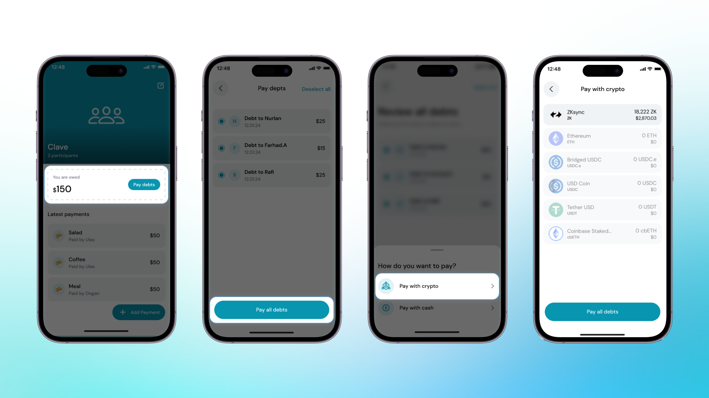

Borçlarınızı ödemek için şu adımları izleyin:
1. **Clave Uygulamasını Açın**: Cihazınızda Clave uygulamasını açın ve bölüştürülmüş grup bölümüne gidin.

2. **Ödenmemiş Borçları Görüntüleyin**: Ne kadar borcunuz olduğunu göreceksiniz. "Borçları Öde" butonuna tıklayın.

3. **Ödemek İstediğiniz Borçları Seçin**: Ödenmemiş borçlarınızın listesi görünecek. Ödemek istediğiniz borçların yanındaki kutuyu işaretleyerek seçin.

4. **Ödeme Yöntemini Seçin**: Borçları seçtikten sonra, ekranın altındaki "Borçları Öde" butonuna tıklayın. Bir ödeme yöntemi seçmeniz istenecek. Tercihinize göre "Kripto ile Öde" veya "Nakit ile Öde" seçeneklerinden birini seçin.

5. **Kripto Seçin**: Kripto ile ödemeyi seçerseniz, sağlanan listeden ödeme yapmak istediğiniz kripto para birimini seçin.

6. **Onaylayın ve Ödeyin**: Ödeme ayrıntılarını gözden geçirin ve işlemi onaylayın. Onaylandıktan sonra, borcunuz ödenmiş olarak işaretlenecektir.

Tebrikler! Bölüştürülmüş borçlarınızı başarıyla ödediniz. Bu süreç, tüm ortak giderlerin zamanında ödenmesini sağlar ve grup finansmanınızı düzenli tutar.