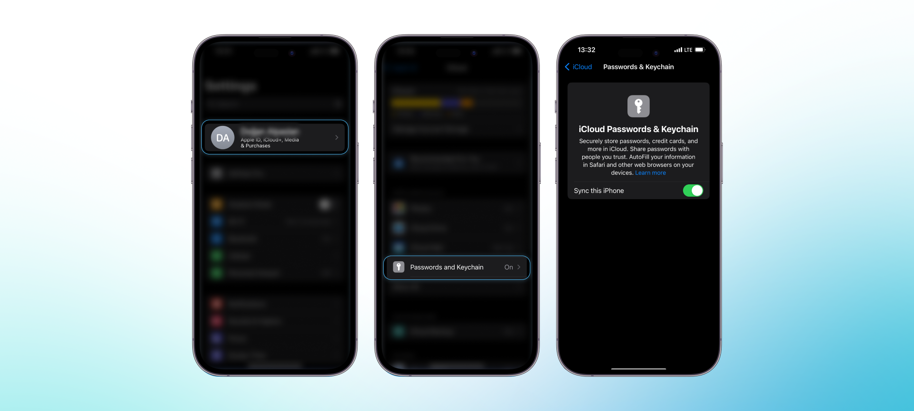
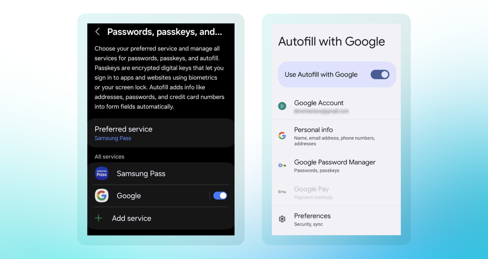

**1. Hesap oluşturamıyorum.**

Android telefon kullanıyorsanız, bazı Android 14 cihazları, Samsung Ultra modelleri, OnePlus gibi telefonlarda Passkey ile ilgili bazı hatalar olduğunu unutmayın. Passkey oldukça yeni bir teknoloji olduğu için tüm Android cihazlarla optimize edilmemiş olabilir.

Öncelikle, telefonunuzun Passkey'i destekleyip desteklemediğini kontrol edin. Bunu yapmak için:

1. **[webauthn.io](https://webauthn.io)** adresine gidin.
2. **Girdi kutusuna herhangi bir metin girin** ve "Register" butonuna tıklayın.
3. **Bir passkey oluşturulduğunu görmelisiniz.** Aşağıdaki resimlerde görüldüğü gibi (sol: Android, sağ: iPhone):

**2. iPhone kullanıyorum ve hesap oluşturma ile ilgili sorun yaşıyorum.**

Öncelikle aşağıdaki ayarları kontrol edin. Sorun devam ederse, Clave Discord'a katılın ve bir Destek bileti açın.

1. **iOS sürümünü kontrol edin.** Passkey'leri etkinleştirmek için yazılım sürümünüzün iOS 16 veya macOS 13 veya daha yüksek olması gerekmektedir.

    iOS sürümünü kontrol etmek için **Ayarlar → Genel → Hakkında** yolunu izleyin. iOS sürümünüz iOS 16'dan eskiyse, **Ayarlar → Genel → Yazılım Güncelleme** altında güncelleyin.

2. **iCloud Parolalar & Anahtar Zinciri Senkronizasyonunu açın.**

    **Ayarlar → Apple ID → iCloud → Parolalar ve Anahtar Zinciri** yolunu izleyin ve "Bu iPhone'u Senkronize Et" seçeneğini etkinleştirin. 

    Senkronizasyon zaten etkin olsa bile, bazen devre dışı bırakıp yeniden etkinleştirmek gerekebilir.

3. **Parolalar ve Passkey Otomatik Doldurmayı açın.**

    **Ayarlar → Parolalar → Parola Seçenekleri** yolunu izleyin.

    Parolalar ve Passkey'ler Otomatik Doldurmayı etkinleştirin.

    "Parolalar ve Passkey'ler Kullan" bölümünde iCloud Anahtar Zinciri'ni etkinleştirin.

**3. Android Telefon kullanıyorum ve hesap oluşturma ile ilgili sorun yaşıyorum.**

Android telefonlar için Passkey ayarlarını yönetmenin tek bir yolu yoktur. Ancak, genel olarak şu yöntemleri izleyebilirsiniz. Bu yöntemler sizin için çalışmıyorsa, cihaz ayarlarında "Passkey" araması yapabilirsiniz. Ayrıca Android cihazlar için [rehberlerimize](android-users) göz atabilirsiniz.

**Birinci Yöntem** (Samsung ile Çalışır)

1. **Ayarlar → Genel Yönetim → Parolalar Passkey'ler ve Otomatik Doldurma** yolunu izleyin ve Google otomatik doldurma seçeneğini etkinleştirin.
2. Passkey sağlayıcınıza (örneğin, Samsung Pass veya Google) bağlı olarak, **Tercih Edilen Hizmeti değiştirebilirsiniz.** Clave ile Google hizmetlerini kullanmanızı öneririz.

**İkinci Yöntem** (Xiaomi ile Çalışır)

1. **Ayarlar → (Hesaplar) → Google → Parola Yöneticisi** yolunu izleyin ve "Google ile Otomatik Doldurmayı Kullan" seçeneğini etkinleştirin.

**4. Hesabımı oluşturdum ama işlemlerim her zaman başarısız oluyor.**

Clave'nin en son sürümüne sahip olduğunuzdan emin olun. Kontrol etmek için [getclave.io/download](https://getclave.io/download) adresini ziyaret edin.

**5. Telefonumu kaybettim/değiştirdim. Cüzdanımı nasıl kurtarabilirim?**

[Recovery](how-to-recover-clave) sayfamıza bakın. Kurtarma işlemini başlatamıyorsanız, Discord üzerinden bizimle iletişime geçin.