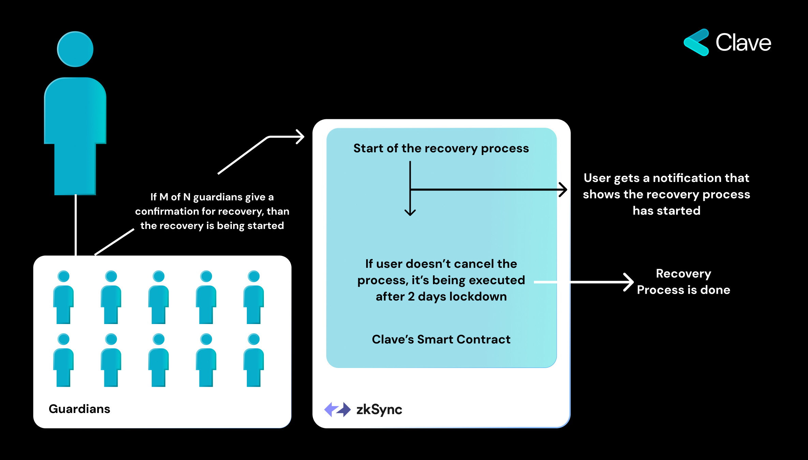

İdeal bir kurtarma mekanizması, Passkey İmzalama gibi ileri teknolojiler kullanılırken dijital varlık güvenliğinin vazgeçilmez bir parçasıdır. Mükemmel bir kurtarma çözümü, kullanıcı dostu, sansüre dirençli, ekonomik, verimli olmalı ve ek güven unsurları gerektirmemelidir.

Clave, sağlam bir kurtarma çözümünün kritik önemini kabul ederek, kötü niyetli aktörlerden kaynaklanan riski azaltmak için 48 saatlik bir kilit özelliğini içeren kapsamlı bir kurtarma mekanizması uygulamıştır.

### İdeal Bir Kurtarma Mekanizmasının Özellikleri:
- **Kullanıcı Dostu:** Mekanizma, teknik bilgisi ne olursa olsun, kullanıcıların kurtarma sürecini kolaylıkla ve doğrulukla yönlendirebilmelerini sağlayacak şekilde sezgisel ve erişilebilir olmalıdır.

- **Sansüre Dirençli:** Mekanizma, dış müdahalelere ve engellemelere karşı dayanıklı olmalı, kullanıcılara çeşitli coğrafi koşullarda kesintisiz erişim sağlamalıdır.

- **Ekonomik Olarak Uygun:** Kurtarma mekanizmasının kullanım maliyetleri minimal olmalı, farklı ekonomik geçmişlere sahip kullanıcıların bu hizmetten faydalanabilmelerini sağlamalıdır.

- **Verimli:** Süreç, kullanıcıların varlıklarına gereksiz gecikmeler veya komplikasyonlar olmadan yeniden erişim sağlamalarını garanti eden, hızlı ve sade olmalıdır.

- **Ek Güven Unsurları Gerekmez:** Mekanizmanın herhangi bir yeni güven unsuru gerektirmemesi önemlidir, böylece kullanıcının varlıklarının bütünlüğü ve güvenliği korunur.

### 48 Saatlik Kilit:
Her iki kurtarma mekanizmasına da dahil edilen 48 saatlik kilit, yetkisiz erişim ve kötü niyetli faaliyetlerden korunmayı sağlamak amacıyla tasarlanmış bir önlemdir. Kurtarma süreci başlatıldıktan sonra kullanıcı, Clave uygulamasından ve/veya e-posta yoluyla bir bildirim alır ve kurtarmayı iptal etmek için 48 saat süre verilir. Bu, kullanıcıların varlıkları üzerinde tam kontrol sahibi olmalarını sağlayarak, yeni güven unsurları eklemeden bir kurtarma mekanizması sunar.

## Birinci Kurtarma Seçeneği: Passkey ile Yerel Kurtarma
Passkey'ler, geleneksel parolalara güvenli ve kullanıcı dostu bir alternatif olarak tasarlanmıştır ve oltalama riskini büyük ölçüde ortadan kaldıran bir teknoloji kullanır. Bu sistem, her hesap için benzersiz bir çift kriptografik anahtar oluşturulmasını içerir: bir tanesi genel anahtar olup sunucuda açıkça saklanır, diğeri ise gizli tutulur ve kullanıcının cihazında güvenle saklanır.

Bir kullanıcı passkey'lerle bir hesap oluşturduğunda, özel anahtarın şifrelenmiş versiyonu bulut aracılığıyla senkronize edilir. Bu, kullanıcılar cihazlarını kaybederse, diğer cihazlardan anahtarı geri alabilecekleri anlamına gelir, eğer cihaz "güvenilir cihaz" olarak seçilirse. Passkey'ler, Güvenli Bölge (biyometri) aracılığıyla şifrelenir ve şifrelenmiş versiyon bulut aracılığıyla paylaşılır. Bu, bulutun bile ihlal edilmesi durumunda kimsenin ona erişemeyeceği anlamına gelir.

Passkey'lere özgü bu yerel kurtarma yöntemi bir kusura sahiptir: tüm cihazlarınızı kaybederseniz hesabınızı kurtaramazsınız. Bu nedenle, Sosyal Kurtarma'yı uygulamış bulunmaktayız.

## İkinci Kurtarma Seçeneği: Sosyal Kurtarma
iCloud veya Google Drive yerine, kullanıcılar gerektiğinde hesaplarını geri almak için ailelerini veya arkadaşlarını seçebilirler. Kullanıcılar, arkadaşlarının veya aile üyelerinin Clave takma adını veya adresini vererek bunu yapabilirler. Bir koruyucu seçtikten sonra, kullanıcılar isterlerse işlemi durdurmak için 48 saatlik bir bekleme süresi vardır.

Yeni bir cihaz kullanarak hesaplarını geri almaya başlamak için kullanıcılar, yardımcılarının Clave takma adını veya adresini vermelidir. Clave, kullanıcıların yardımcılarına göndereceği bir bağlantı oluşturacaktır. Bir koruyucu seçmek gibi, kurtarma sürecinde de 48 saatlik bir bekleme süresi vardır, bu da kullanıcılara gerekirse orijinal cihazdan durdurma şansı verir.

Sosyal Kurtarma olarak adlandırılan bu yöntem, kullanıcıların hesaplarını güvende tutmak için daha fazla seçenek sunmayı, güvenliği arkadaş veya aile yardımıyla birleştirmeyi ve tüm süreci yönetmeyi kolaylaştırmayı amaçlar.

## Üçüncü Kurtarma Seçeneği: ZK-Email ile Evrensel Kurtarma
Sosyal Kurtarma güçlü bir araçtır, ancak bir sınırlaması vardır: Koruyucu'nun bir zincir üstü adresine sahip olması gerekir. Bunu aşmak için Clave, herkesin e-posta hesaplarını kullanarak bir Clave Koruyucusu olmasını sağlayan yeni bir kurtarma yöntemi olan Evrensel Kurtarma'yı tanıttı.

Evrensel Kurtarma, DKIM imzalarını doğrulamak için ZK Email'i kullanır ve güvenli ve güven unsurlarını ortadan kaldıran bir operasyon sağlar. Bu yenilikçi yaklaşım, güvenliği tehlikeye atmadan koruyuculuk erişimini genişletir. Daha teknik detaylar için [sonraki bölüme](zkemail-recovery-technical) bakabilirsiniz.