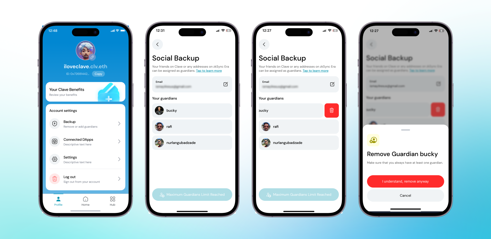
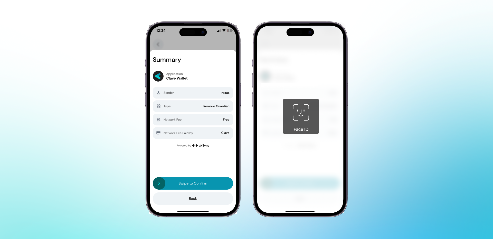

Koruyucunuz tehlikeye girdiyse veya kötü niyetli davranıyorsa, koruyucuyu sosyal kurtarma ayarınızdan kaldırmanız gerekmektedir. Bir koruyucuyu kaldırmak için aşağıdaki adımları izlemelisiniz:

1. **Clave uygulamasını açın** ve profilinize gidin.
2. **"Sosyal Yedekleme"ye tıklayın** ve koruyucularınızı görüntüleyin ve yönetin.
3. **Kaldırmak istediğiniz koruyucuyu seçip sola kaydırın.**
4. **Koruyucunun adının yanındaki çöp kutusu simgesine tıklayın.**
5. **"Anladım, yine de kaldır"** diyerek kaldırmayı onaylayın.

6. **İşlemi onaylamak için kaydırın** ve biyometrik kimliğinizle kimlik doğrulaması yapın.
7. **Koruyucuyu hesabınızdan başarıyla kaldırdınız.**

Bu adımları izleyerek Clave hesabınızın güvenliğini sağlayabilir ve yetkisiz kurtarma girişimlerini önleyebilirsiniz. Eğer endişeleriniz varsa, güvenliğiniz için her zaman koruyucularınızı güncelleyebilirsiniz.