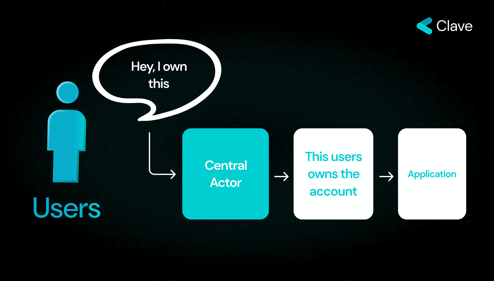
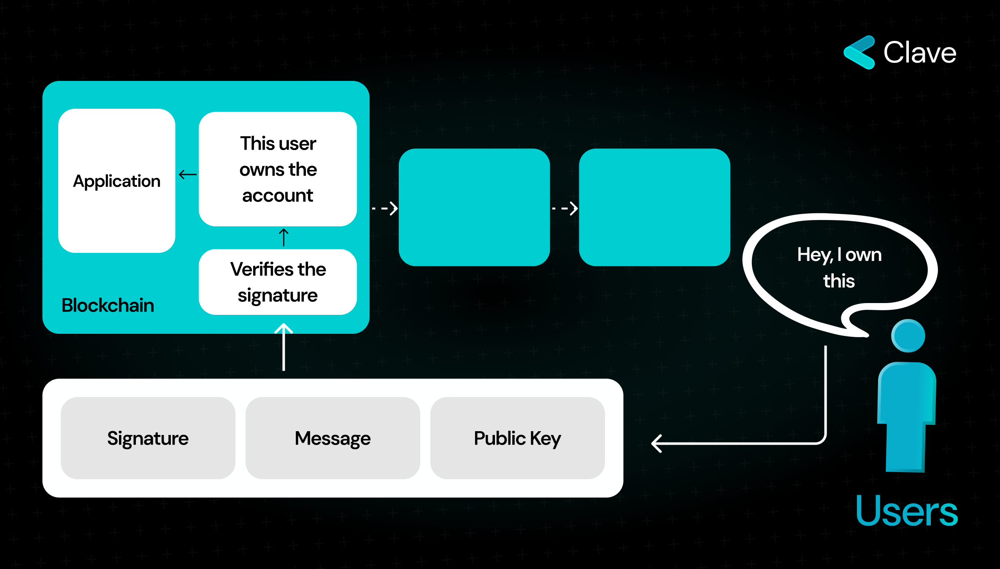
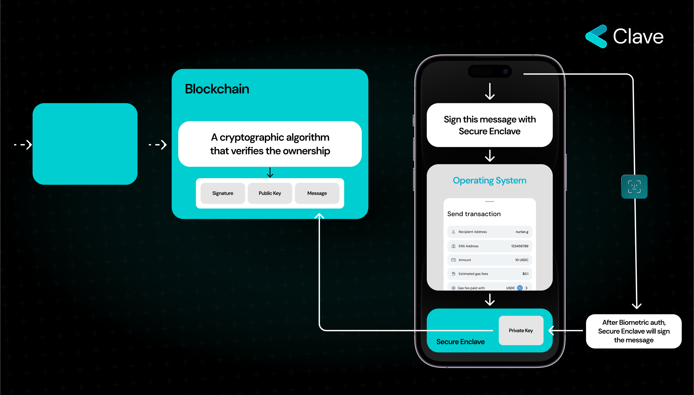

Neredeyse tüm modern cihazların iki ana bileşeni vardır: **bir işletim sistemi** (ve ilgili paylaşımlı depolama) ve bir **Secure Enclave**. İşlemcisi. Biyometrik verilerin korunması, kriptografik anahtarlar, şifreleme ve cihaz kilidinin açılması gibi hassas görevleri Secure Enclave yaparken geri kalan görevleri İşletim Sistemi yürütür.

Geliştiriciler, hassas işlemleri ayrı olarak yönetmek için Secure Enclave adlı özel bir mikroçip ürettiler. Secure Enclave, bir donanım cüzdanı gibi çalışır; bağımsız olarak çalışır, hassas verileri güvenli bir şekilde işler ve cihaz sahibinin bile içeriğe erişimi yoktur. Neyse ki, Secure Enclave, özel anahtarların oluşturulması ve mesajların imzalanması gibi kriptografik işlemleri destekler. Secure Enclave, verileri güvenli bir şekilde depolamak için çeşitli önemli özelliklere sahiptir.

**Secure Enclave İzoledir:** Secure Enclave, biyometrik verilerin ve kriptografik anahtarların korunması gibi hassas işlemlerin güvenli bir ortamda, sistemin diğer kısımlarına erişilemeyecek şekilde işlenmesini sağlar.

**Secure Enclave Özel Bir Mikroişlemciye Sahiptir:** Secure Enclave, Apple tarafından özelleştirilmiş bir L4 mikrokernel çalıştıran kendi mikroişlemcisine sahiptir. Bu mikroişlemci, yalnızca güvenli işlemler için ayrılmıştır ve güçlü bir izolasyon sağlar, saldırı vektörlerini engeller.

**Secure Enclave Bellek Korumasına Sahiptir:** Secure Enclave, cihazın DRAM belleğinin özel bir bölgesini kullanır ve birden fazla koruma katmanı içerir. Bu, bellek erişilse bile verilerin güvenli kalmasını sağlamak için şifreleme ve kimlik doğrulama mekanizmalarını içerir.

**Secure Enclave Güvenli Bir Önyükleme Sürecine Sahiptir:** Secure Enclave, bir donanım güven kökünü oluşturan özel bir Secure Enclave Boot ROM içerir. Başlatma sırasında, Secure Enclave Boot ROM bellek korumasını başlatır ve yazılımın kriptografik bütünlüğünü doğrular, böylece yalnızca yetkilendirilmiş yazılımın çalışmasına izin verir. Yani önceden belirlenmiş fonksiyonlar dışında bir fonksiyon yürütmez.

**Secure Enclave Kriptografik İşlemler Yapabilir:** Secure Enclave, anahtar üretimi ve imzalama dahil olmak üzere çeşitli kriptografik işlemleri destekler. Bu, özel anahtarların Secure Enclave içinde oluşturulabileceği ve kullanılabileceği anlamına gelir; böylece bu anahtarlar sistemin geri kalanına maruz kalmaz. Bu özellikler, Secure Enclave'i donanım düzeyinde güvenli bir hale getirir. Peki, donanım güvenliği ne anlama gelir? Donanım düzeyinde güvenlik, izole edilmiş, bellek korumalı ve kurcalamaya karşı dayanıklı bir güvenlik anlamına gelir. Ve gördüğünüz gibi, Secure Enclave bunu destekler.

Clave, özel anahtarları saklamak ve mesajları güvenli bir şekilde imzalamak için Secure Enclave'i kullanan bir kimlik doğrulama mekanizması olan Passkey'leri kullanır. Bu sayede Clave, donanım düzeyinde güvenlikle tek tıklamayla giriş yapmayı mümkün kılar.

## Clave, Sıcak Cüzdanlar ve Donanım Cüzdanları Arasındaki Farklar Nelerdir?

Clave'i geliştirirken net bir vizyonumuz vardı: günlük cihazlarınızı güvenli bir donanım cüzdanına dönüştürmek. Clave, passkey tabanlı kimlik doğrulama ile artık yayında ve kitlesel kullanıma hazır. Ancak soru şu: Clave gerçekten bir donanım cüzdanının güvenliğini sunuyor mu? Hadi bu konuyu derinlemesine inceleyelim.

### Özel Anahtar Oluşturma

**Donanım Cüzdanları:** Bu cüzdanlar, özel anahtarları cihazın içinde oluşturur. Anahtarlar işletim sistemine (OS) maruz kalmaz, bu da cihaz tehlikeye girse bile anahtarların korunmasını sağlar.

**Sıcak Cüzdanlar:** Aksine, Sıcak Cüzdanlar anahtarları doğrudan işletim sisteminde oluşturur, bu da cihaz tehlikeye girdiğinde anahtarları savunmasız hale getirir.

**Clave (Tüketici-TEE Tabanlı Cüzdanlar):** Clave, özel anahtarları donanımın secure enclave'inde oluşturur, böylece bu anahtarlar işletim sistemine maruz kalmaz ve donanım cüzdanlarının güvenlik protokollerini aynalar. Anahtarlar kimse tarafından erişilemez.

### Anahtar Saklama

**Donanım Cüzdanları:** Anahtarlar cihaz içinde saklanır ve işletim sistemi üzerinden erişilemez.

**Sıcak Cüzdanlar:** Anahtarlar işletim sistemi üzerinde saklanır, bu da cihaz güvenliği ihlal edilirse risk oluşturur.

**Clave (Kullanıcı-TEE Tabanlı Cüzdanlar):** Anahtarlar secure enclave'de şifrelenir ve şifrelenmiş versiyon işletim sisteminde saklanır. Bu yöntem, donanım cüzdanlarının güvenlik protokollerini yansıtır. Ve kimse bu anahtarlara erişemez.

### İşlem İmzalama

**Ekranlı Donanım Cüzdanları:** Kullanıcılar, güvenli olarak kabul edilen ve yalnızca yazılım güncellemeleriyle güncellenebilen cihazın ekranına güvenir.

**Ekransız Donanım Cüzdanları:** Kullanıcılar, hot wallet'lar gibi imzaladıkları şeyleri görmek için cüzdan yazılımına güvenirler.

**Sıcak Cüzdanlar:** Kullanıcılar, işlem ayrıntılarını doğru şekilde imzalamak için cüzdan yazılımına güvenmek zorundadır.

**Clave (Tüketici-TEE Tabanlı Cüzdanlar):** Clave, bir mobil uygulama aracılığıyla çalışır ve kullanıcıların imzaladıkları şeyleri göstermek için uygulamaya güvenmesini gerektirir. Bu, hot wallet'lara benzese de, Clave ile geleneksel donanım cüzdanları arasındaki farkın minimal olduğunu unutmamak önemlidir çünkü donanım cüzdanı yazılım güncellemeleri Clave'in uygulama güncellemelerine benzer.

Clave'nin Passkey'lerle desteklenen onboarding sürecine göz atın:
<iframe
  width="860"
  height="500"
  src="https://www.youtube.com/embed/aM8x2qE3tgU?si=KTcvzeoYTUIZiJXK"
  title="YouTube video player"
  frameborder="0"
  allow="accelerometer; autoplay; clipboard-write; encrypted-media; gyroscope; picture-in-picture"
  allowfullscreen
></iframe>

