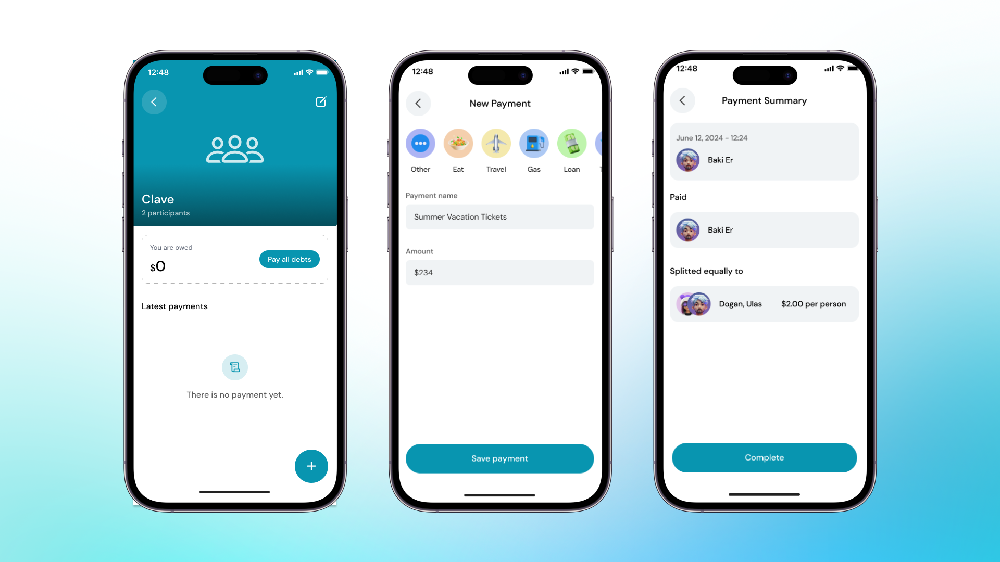

Arkadaşlarınızla paylaşılan masrafları yönetmek hiç bu kadar kolay olmamıştı. Clave uygulamasını kullanarak harcama bölüştürme grubunuza nasıl ödeme ekleyebileceğinizi öğrenmek için aşağıdaki adımları izleyin:

1. **Clave Uygulamasını Açın**:
   Cihazınızdaki Clave uygulamasını açın ve Harcama Bölüştürme grubunuza gidin.

2. **Grubu Seçin**:
   Ödeme eklemek istediğiniz Harcama Bölüştürme grubunu seçin.

3. **Ödeme Ekle**:
   Ekranın altındaki "Ödeme Ekle" butonuna tıklayın.

4. **Ödeme Detaylarını Girin**:
   - **Kategori**: Masrafın kategorisini seçin (örneğin, Yemek, Seyahat, Bilet, Borç).
   - **Ad**: Masrafın bir açıklamasını girin (örneğin, Pizza).
   - **Tutar**: Masrafın tutarını girin.

5. **Devam Et ve Onayla**:
   Ödeme detaylarını gözden geçirmek için "Devam Et" butonuna tıklayın. Ödeme bilgilerinin doğru olduğundan emin olun.

7. **İşlemi Tamamlayın**:
   'Tamamla' butonuna tıklayarak ödemeyi ekleyin. Masraf artık kaydedildi ve tutar grup üyeleri arasında eşit olarak bölündü.

    

Tebrikler! Harcama Bölüştürme grubunuza başarıyla bir ödeme eklediniz. Bu, paylaşılan tüm masrafların organize olmasını sağlar ve herkesin kendi payından haberdar olmasını garanti eder.

Borçlarınızı nasıl ödeyeceğinizi öğrenmek için bir sonraki kılavuza göz atın ->