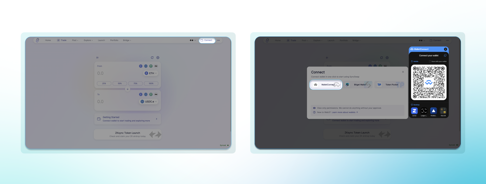
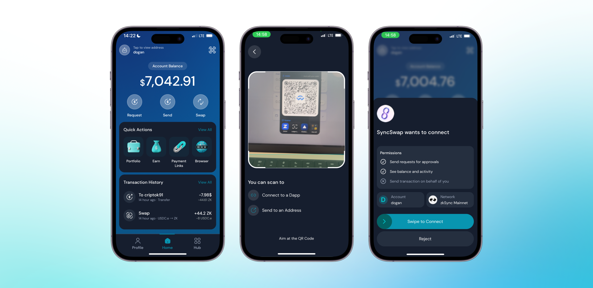
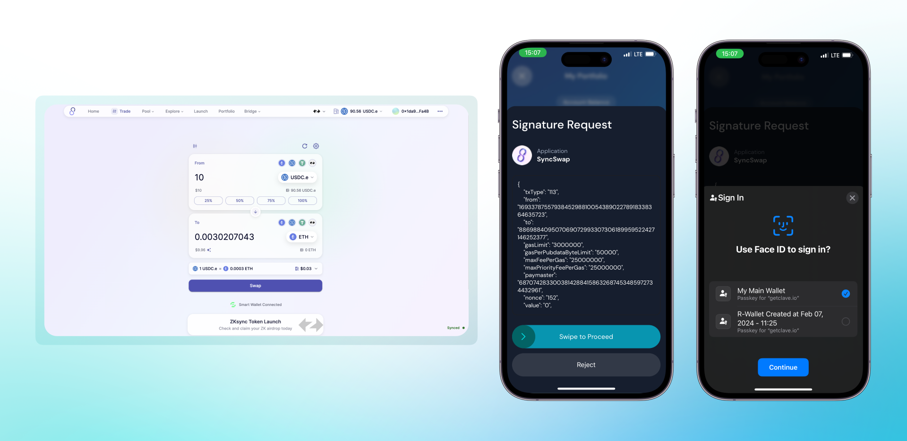

Wallet Connect, Clave'i **Wallet Connect bağlantılarını destekleyen herhangi bir dapp'e** bağlamamıza olanak tanır. Wallet Connect kullanarak Clave cüzdanınızı bağlamak için şu adımları izleyin:

1. **Cüzdanınızı bağlamak istediğiniz web sitesine gidin.**
2. Web sitesinde **"Connect Wallet" (Cüzdanı Bağla) düğmesine** tıklayın.
3. Cüzdan seçenekleri listesinden **"Wallet Connect"** seçeneğini seçin.

   

4. **Clave uygulamasını açın** ve sağ üstteki QR düğmesine tıklayın.
5. **Tarayıcıda görüntülenen QR kodunu** Clave uygulamasını kullanarak tarayın.
6. **Devam etmek için kaydırın** ve bağlantıyı tamamlayın.

   

Wallet Connect kullanarak Clave cüzdanınızı bir dApp'e bağladıktan sonra, işlemleri tarayıcınızdan kolayca gerçekleştirebilirsiniz. İşte nasıl yapacağınız:

1. **İşlemi başlatın** tarayıcınızdaki dApp'te (örneğin, SyncSwap'te bir takas).
2. Tarayıcınızda, işlem detaylarını gösteren ve cüzdanınızda oturum açmanızı isteyen bir **onay ekranı** görünecektir.
3. Bağlandığınız dApp'ten **İmza İsteği**'ni göreceğiniz Clave uygulamasını açın.
4. Clave uygulamasında **işlem detaylarını gözden geçirin** ve her şeyin doğru olduğundan emin olun.
5. İşlemi onaylamak ve imzalamak için **Face ID veya parmak izi** kullanın.
6. **Devam etmek için kaydırın** ve biyometrik kimlik doğrulamayı tamamlayın.
   

Artık işlemleri nasıl gerçekleştireceğinizi bildiğinize göre, Clave ile fonlarınızın tam güvenliğini ve saklama kontrolünü sağlayarak dApp'lerle sorunsuz bir şekilde etkileşimde bulunabilir ve işlemleri gerçekleştirebilirsiniz.