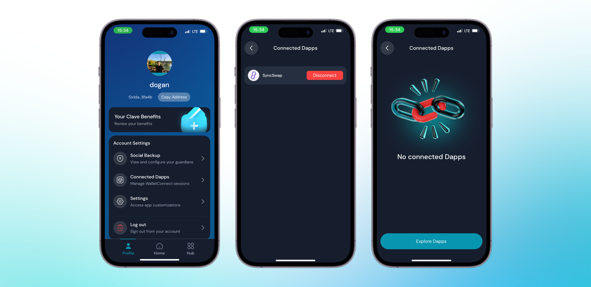

Bağlı dApp'lerinizi görüntülemek ve yönetmek için şu adımları izleyin:

1. **Clave uygulamasını açın** ve profil bölümüne gidin.
2. **Hesap Ayarları'nda "Bağlı Dapp'ler"** seçeneğine tıklayın.
3. Burada, **aktif Wallet Connect oturumlarınızı** görebilirsiniz.

4. **Bir oturumu sonlandırmak** için, kaldırmak istediğiniz dApp'in yanındaki "Bağlantıyı Kes" düğmesine tıklamanız yeterlidir.

Artık Wallet Connect oturumlarınızı nasıl yöneteceğinizi bildiğinize göre, bağlantılarınızı kolayca izleyebilir ve daha fazla güvenlik ve kullanım kolaylığı için kontrol edebilirsiniz.