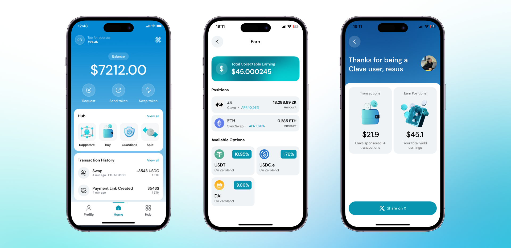

### Clave'nin Sunduğu Avantajlar:
⏩ Tek Tıkla Hesap Oluşturma

🆓 Gazsız (İşlem Ücreti Olmayan) İşlemler

💰 Kazanç Fırsatları

🔗 Linklerle Token Gönderimi

1️⃣ Her şeyi Tek Tıkla Yapabilme İmkanı
——————————————————————————————————————————————————

### Clave, ZK Sevdalısı! 💊
⚡️ Clave, Ethereum ZK rollup'ı olan ZKsync Era üzerinde çalışır.

🫵🏻 Clave, ZK ekosistemindeki en iyi getiri fırsatlarını sunar.

🪄 Clave, işlem yapmanın en kolay yoludur - anahtar kelime yok yok, sadece biyometrik onay ve sosyal kurtarma. 

❕Clave, ZK ekosisteminde en iyi finansal çözümleri cebinize getirmek için çalışır.

——————————————————————————————————————————————————

### Clave Size Finansal Özgürlük Veriyor! ⛓️‍💥

🤼‍♂️ Clave tamamen kendi kendine saklama sağlar, yani her şey sizin kontrolünüz altında!

⌛️ Clave, donanım düzeyinde güvenlik ile sosyal kurtarmayı birleştirir - en üst düzey güvenlik ve geri kazanım birlikte sunulur.

📱Clave, akıllı bir cüzdandır, bu yüzden programlanabilirlik mümkündür. Ayrıca, Clave'de daha fazla kurtarma yöntemi, güvenlik modülleri ve yenilikler mevcut olacaktır.

📲 Clave, mobil öncelikli bir yaklaşıma sahiptir.

——————————————————————————————————————————————————

### Clave Donanım Düzeyinde Güvenlik Sunar! 🔒

🎫 Clave, passkey ve biyometrik kimlik doğrulama ile desteklenir.

💻 Clave, hassas verilerinizi korumak için günlük cihazların donanım elemanlarını kullanır.

🗝️ Anahtarlarınız cihazınızı asla terk etmez.

——————————————————————————————————————————————————

### Clave Rakiplerinden Nasıl Farklı? 👾

🛩️ Clave, bir Akıllı Cüzdandır.

🆓 Clave'deki ağ ücretleri **tamamen ücretsizdir!**

🌽Clave, donanım cüzdanlarıyla aynı güvenliği sağlamak için TEEs (ör. Secure Enclave, Android Trustzone) kullanır.

🤽 Clave, sosyal kurtarma sunar; cüzdanınızı geri kazanmak için hiçbir şeyi hatırlamanıza gerek yok - sadece arkadaşlarınızı veya ebeveynlerinizi güvenilir kişiler olarak ekleyin. 

🚔 Clave, sektör lideri denetçiler tarafından denetlenmiştir.

Hadi [Clave'yi nasıl kullanacağınızı öğrenelim!](how-to-create-account)