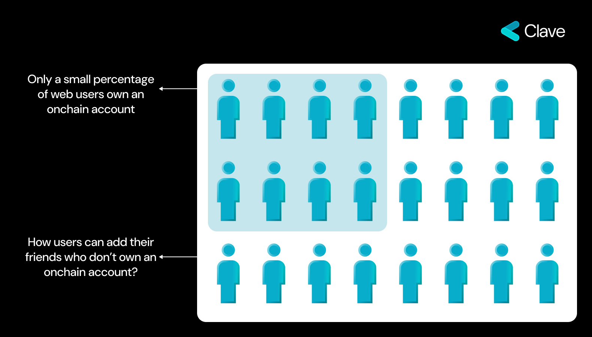
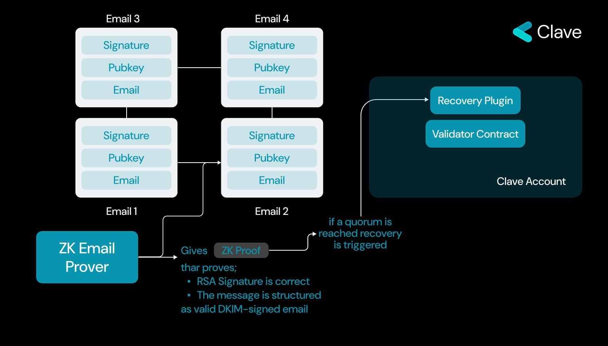
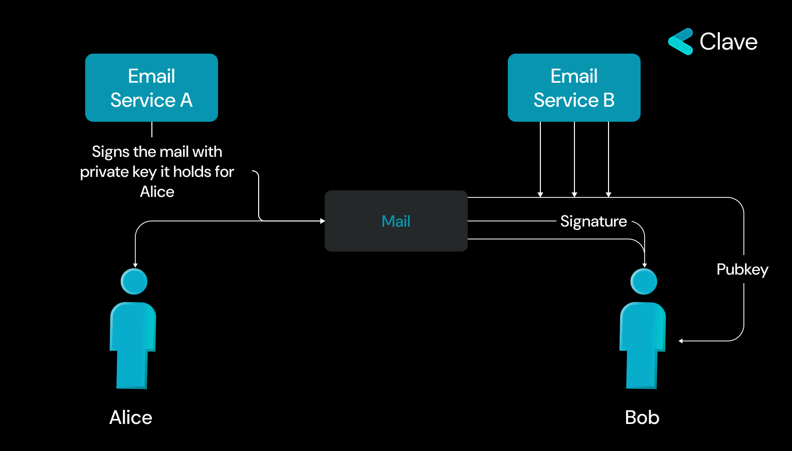
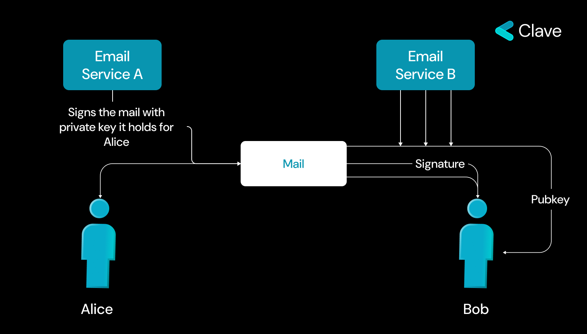

Akıllı sözleşme altyapımız için bir kurtarma modülü geliştirdik. Bu mekanizma, sorunsuz bir başlangıç için passkey'leri kullanır ve hesap kurtarma için Evrensel Kurtarma'yı entegre eder. Bu sistemin önemli bir özelliği, kullanıcıların herhangi bir arkadaşlarını, e-posta adresi kullanarak güvenilir kişi olarak atamasına izin vererek, Clave cüzdanımızda erişilebilir ve güvenli hesap kurtarma seçeneklerinin kapsamını genişletmesidir.

Evrensel Kurtarma'nın temeli, belirli bir e-posta adresini, aracıdan gelen bir e-postayı yanıtlayarak kurtarmayı başlatmak için yetkilendirmektir. Bunu mümkün kılmak için Clave Modül Sözleşmeleri yapısını takip ederek Evrensel Kurtarma Modülünü geliştirdik. Kısacası, bu model kullanıcının güvenilir kişi olarak eklediği e-postaları saklar ve kurtarmanın, güvenilir kişi tarafından gönderilen e-postaları kullanarak aracı tarafından oluşturulan sıfır bilgi kanıtını kontrol ederek başlatılıp yürütülebileceğini sağlar. Kullanıcı, yalnızca güvenilir kişinin e-posta adresini yazarak güvenilir kişiyi ekleyebilir. Bundan sonra kurtarma ekleme süreci tamamlanır. Kullanıcı, herhangi bir nedenle hesaba erişimini kaybederse, hesabı yeniden kurtarmak için gerekli olan tek şey, güvenilir kişinin yeni genel anahtarla birlikte aracıya bir e-posta yanıtlamasıdır. Aracı, gelen e-posta sayesinde bir kanıt oluşturabilir ve bu kanıtla startRecovery işlevini tetikleyebilir. Bu şekilde, sözleşmenin yönetilmesine izin veren genel anahtar değiştirilir ve kullanıcı hesabın kontrolünü yeniden kazanır. Peki ZK-Email nasıl çalışır?

## ZK-Email ile Web2 ve Web3 Arasında Matematik Temelli Bir Köprü Tanıtımı

**E-posta Protokolleri Nasıl Çalışır?**

E-posta protokolleri, maillerin doğruluğunu sağlayabilmek için DKIM kullanır. Bu kimlik doğrulama yöntemi, e-posta sahteciliğini önler. DKIM, RSA anahtar algoritmasını kullanır, bu anahtar çifti Web3 anahtar algoritmalarına benzerdir ancak algoritmanın temeli farklıdır.. E-posta gönderenin sunucusu, her e-posta için benzersiz bir dijital imza oluşturmak için özel bir anahtar kullanır ve bu imza e-posta başlığına eklenir. Alıcı sunucusu, DNS kayıtlarında bulunan gönderenin genel anahtarını kullanarak bu imzayı doğrular. Eşleşen bir imza, e-postanın doğruluğunu ve bütünlüğünü teyit eder, böylece e-posta güvenliğini artırır.

Bunu etkinleştirmek için her e-postada şu bilgiler bulunur:

- İmza
- Mesaj
- Bir Genel Anahtar

Bu imzayı blok zincirinde doğrulayabilirsek, yalnızca bir e-posta adresiyle ve aracı olmadan zincir üstü bir hesap oluşturmak mümkün olabilir. Ancak DKIM'in doğrudan zincir üstünde doğrulanması, gizliliği bozar ve ayrıca RSA imzası, blok zincirlerinde yerel olarak desteklenmez, bu nedenle RSA imzasını doğrulamak pahalı olabilir. Bu nedenle, DKIM'i zincir üstünde doğrulamak için Sıfır Bilgi kanıtlarına ihtiyacımız var.

Her e-posta bir imza, mesaj, genel anahtar ve gönderenin adresini içerir. İmzayı blok zincirinde doğrularken, genel anahtarın açıklanması gerekir ve bu da gizliliği tehlikeye atabilir. Bunun nedeni, blok zincirini inceleyen herhangi bir kişinin hem e-posta adresini hem de ilgili hesap adresini görebilmesi ve kişisel bilgilerin ifşa olma riskinin oluşmasıdır. Bu nedenle, e-posta tabanlı blok zinciri doğrulaması yapılırken gizliliği sağlamak önemlidir. ZK-Email protokolü ile bir mesajın belirli bir e-posta adresinden geldiğini kanıtlamak, zincir üstünde mümkün hale gelir ve bu da o e-postaya doğrudan bağlı bir zincir üstü cüzdan oluşturmayı sağlar. Bu teknik, e-posta tabanlı kimliklerin blok zinciri teknolojisiyle entegrasyon sürecini basitleştirir ve hem gizlilik hem de verimliliği sağlar.

### Nasıl çalışır?

ZK-Email protokolü ile neler olup bittiğini basitçe özetleyelim:

1. Kullanıcılar bir e-posta adresiyle mesaj imzalarlar.

2. İmzalanmış mesaj, imza ve genel anahtarıyla birlikte bir doğrulayıcıya gönderilir.

3. Doğrulayıcı, e-postanın DKIM imzasını doğrular ve ardından bu verilerden bir Sıfır Bilgi kanıtı üretir.

4. Bu ZK kanıtı, blok zincirinde doğrulanır ve bu e-posta tabanlı hesap kimliğinin kullanılabilirliği sağlanır.

Not: Clave'nin ZK-Email sözleşmeleri hala denetim altında ve **henüz** açık kaynaklı değil

