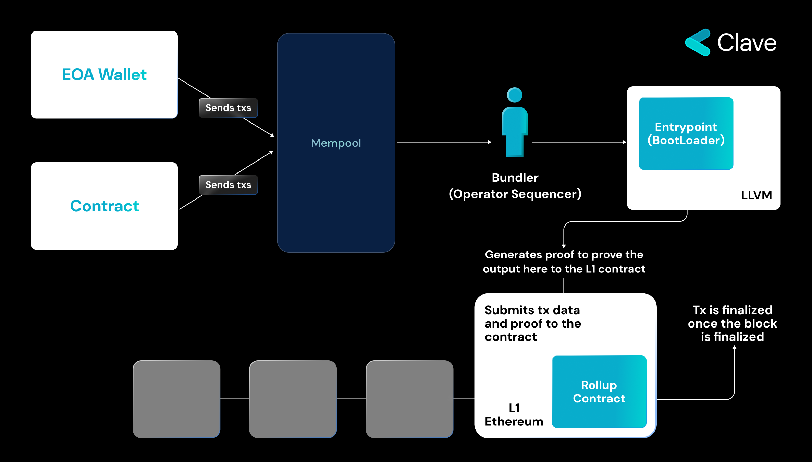
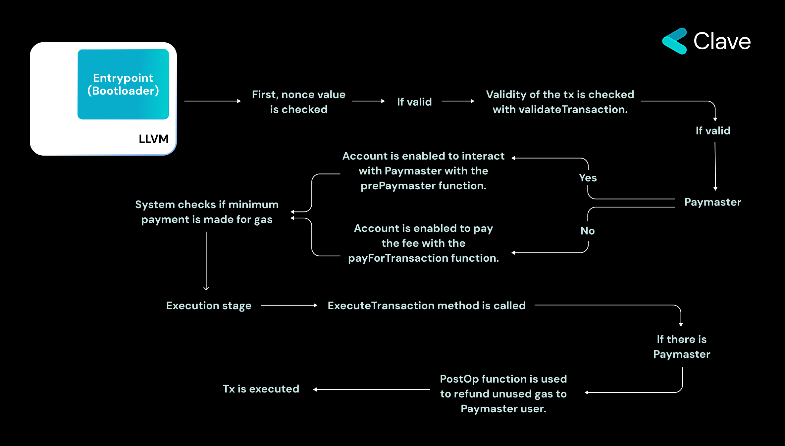

Hesap Soyutlama, Ethereum'un başlangıcından beri önemli bir hayaldi. Bu önemli çünkü mevcut hesap modeli sınırlıdır ve programlanabilir değildir. Bu sınırlamaların üstesinden gelmek için, Ethereum geliştiricileri Akıllı Sözleşme tabanlı hesaplar, yani Akıllı Hesaplar geliştirdiler. Ancak, Akıllı Hesaplar ile ilgili büyük bir zorluk, bu hesapların bağımsız olarak işlem başlatamamasıdır. Bunun nedeni, Akıllı Sözleşme tabanlı hesapların ikinci sınıf vatandaşlar olarak kabul edilmesi ve Ethereum'da yerel olarak desteklenmemesidir.

Ethereum çekirdek geliştiricileri Hesap Soyutlaması için EIP-86, EIP-2938, EIP-3074 ve EIP-7702 gibi birkaç çözüm önerdiler. Ancak, bu önerilerin her biri, Ethereum protokolünde değişiklikler gerektirdiği için uygulanmaları zor oldu çünkü Ethereum şu anda 30 milyar dolarlık kilitli varlıklarla ekonomik olarak en aktif blok zinciridir. Bu nedenle, protokol seviyesindeki yükseltmeleri gerçekleştirmek oldukça zordur ve uzun zaman alır. Öyle ki "The Merge", 5 yıllık bir koordinasyon sonucu gerçekleştirilebildi. Bu yüzden ERC-4337 AA teklifi, protokol değişiklikleri gerektirmediği için büyük ilgi gördü. Ancak, ERC-4337'nin bir dezavantajı vardır: Bu, büyük ölçekte ölçeklendirmeyi zorlaştıran çok fazla ekstra altyapı gerektirir. Ayrıca, ERC-4337 ile bile Akıllı Hesaplar ikinci sınıf vatandaşlar olarak kalır.

Ancak Rollup'lar, geriye dönük uyumluluk ve karmaşık yönetişim süreçleri gibi sorunlarla karşılaşmazlar. Tamamen yeni zincirler oldukları için Ethereum'dan güvenlik miras alırlar ve bu nedenle geriye dönük uyumluluk sorunlarından muzdarip olmazlar. Ethereum üzerinde bir ZK rollup olan ZKsync, yerel Hesap Soyutlama ile geliştirilmiştir ve bu, ERC-4337'ye benzer ancak yerel olarak uygulanmıştır. Şimdi nasıl çalıştığını keşfedelim:

### ZKsync Era'nın Yerel Hesap Soyutlaması
Daha önce belirtildiği gibi, zkSync, ERC-4337'ye benzer bir entegrasyona sahiptir. zkSync ayrıca işlemleri sıralamak ve Batch'e eklemek için bir Sequencer kullanan bir ZK-Rollup çözümüdür. zkSync Era'da EIP 4337 ve Starknet'te olduğu gibi iki aşama vardır. Burada, EOA ve Sözleşme hesapları aynı mempool'a işlemler gönderir. EOA ve Sözleşme hesapları için aynı mempool'u paylaşmak, Paymaster'ların EOA işlemlerini de sponsor etmelerini sağlar, bu orijinal 4337 uygulamasında yapılamaz. Bu nedenle, zkSync Era'da, EOA'nın işlemlerini sponsor eden bir Paymaster oluşturabilirsiniz. Operator (4337'deki Bundler'a benzer) işlemleri toplar, ardından bunlar EVM'de Bootloader adlı bir akıllı sözleşme aracılığıyla (4337'deki entrypoint'e benzer) yürütülür. Ne yazık ki, zkSync'de simülasyonun (zincir dışı işlem) nasıl gerçekleştiği hakkında fazla bilgi bulamadım, bu yüzden zincir üstünde neler olduğunu açıklayayım:

**1. İşlemin geçerliliğinin kontrol edildiği doğrulama aşaması:**

İlk olarak, nonce değerinin geçerliliği kontrol edilir. (Not: zkSync'deki nonce entegrasyonu belirli bir sıraya dayalı olduğundan, bir cüzdan aynı anda yalnızca bir işlem başlatabilir. Ekip bu durumu gelecekte güncellemeyi planlamaktadır.) Operator ilk olarak validateTransaction işlevini çağırır. Bu işlev işlemin geçerliliğini kontrol eder ve eğer geçerliyse bir sonraki aşamaya geçer. Bir sonraki aşamada, işlemin ücreti ödenir. Ücretin Paymaster'dan mı yoksa doğrudan kullanıcının cüzdanından mı alınacağını kontrol etmek için üç farklı işlev yürütülür. Doğrulamanın son aşamasında, Bootloader işlemi çağırmak için gerekli ücreti aldığını kontrol eder.

**2. İşlemin yürütülme aşaması:**

Bu aşama iki kısımdan oluşur. İlk olarak executeTransaction işlevi çağrılır. Daha sonra, eğer Paymaster kullanıldıysa PostOp işlevi çağrılır. Bu işlev, Paymaster'ın ERC20 tokenleri kullanarak ücret ödemesini kolaylaştırmak için tasarlanmıştır.

