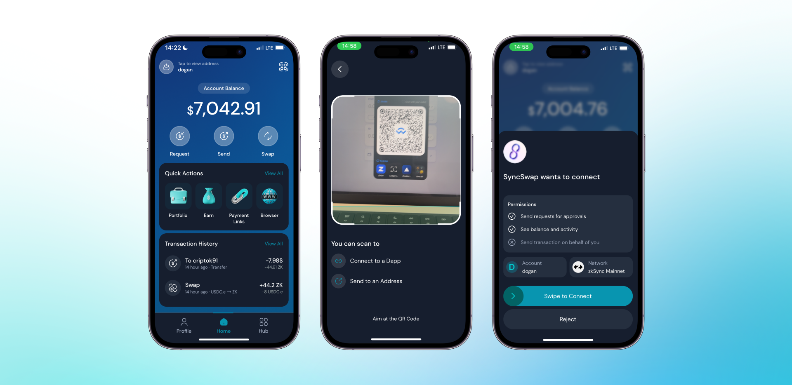
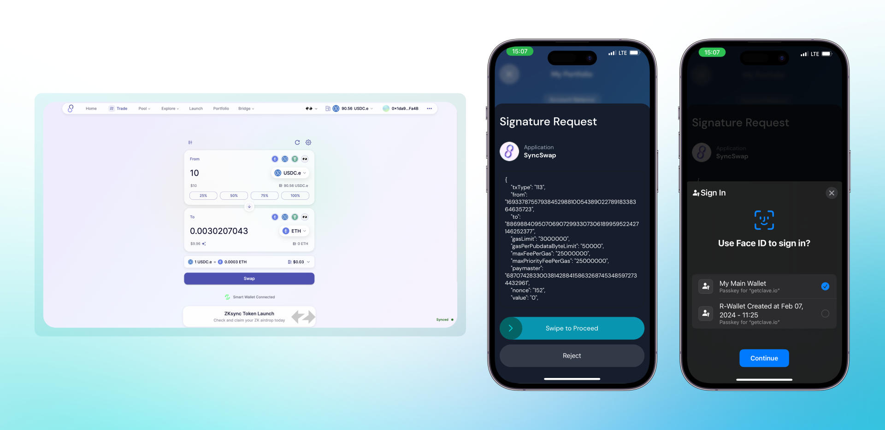

Wallet Connect allows us to connect Clave to **any dapp** that supports Wallet connect connections. Follow these steps to connect your Clave wallet to a dApp using Wallet Connect:

1. **Go to the website** where you want to connect your wallet.
2. **Click the "Connect Wallet" button** on the website.
3. **Select "Wallet Connect"** from the list of wallet options.

   

4. **Open the Clave app** and click the QR button at the top right.
5. **Scan the QR code** displayed in the browser using the Clave app.
6. **Swipe to proceed** and complete the connection.

   

After connecting your Clave wallet to a dApp using Wallet Connect, you can easily make transactions directly from your browser. Here’s how:

1. **Initiate the transaction** in the dApp on your browser (e.g., a swap on SyncSwap).
2. A **confirmation screen** will appear in your browser, indicating the transaction details and prompting you to sign in your wallet.
3. Open the Clave app, where you will see a **Signature Request** from the dApp you connected to.
4. **Review the transaction details** in the Clave app to ensure everything is correct.
5. **Use Face ID or fingerprint** to sign in and approve the transaction.
6. **Swipe to proceed** and complate biometric authentication.
   
Now that you know how to make transactions, you can seamlessly interact with dApps and execute transactions while maintaining full custody and security of your funds with Clave.

