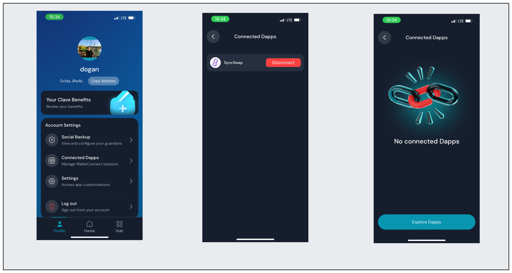

Follow these steps to view and manage your connected dApps:

1. **Open the Clave app** and navigate to the profile section.
2. **Click on "Connected Dapps"** in the Account Settings.
3. Here, you can **see your active Wallet Connect sessions**.

4. **To disconnect a session**, simply click the "Disconnect" button next to the dApp you want to remove.

Now that you know how to manage your Wallet Connect sessions, you can easily monitor and control your connections for enhanced security and convenience.

