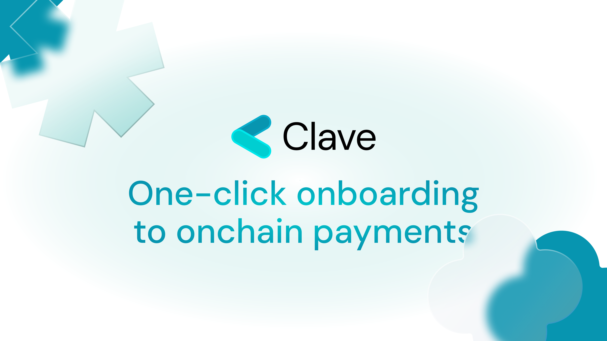

### Clave Offers:
⏩ One-Click Onboarding

🆓 Gasless Transactions

💰 Yield Opportunities

🔗 Sending tokens with links

1️⃣ Everything is one-click
——————————————————————————————————————————————————

### Clave is ZK Pilled! 💊
⚡️Clave runs on ZKsync Era - an Ethereum ZK rollup.

🫵🏻 Clave brings the best yield opportunities in the ZK ecosystem.

🪄 Clave is the easiest way to transact - no seed, just biometrics, and social recovery. 

❕Clave works hard to bring the best financial solutions to your pocket in the ZK ecosystem.

——————————————————————————————————————————————————

### Clave Gives You the Financial Freedom! ⛓️‍💥

🤼‍♂️ Clave is fully self-custodial, which means that everything is under your control!

⌛️ Clave combines hardware-level security with social recovery - you have the best grade security and recoverability together. 

📱Clave is a smart wallet, so programmability is possible. In addition, more recovery methods, security modules, and innovations will be available on Clave.

📲 Clave has a mobile-first approach.

——————————————————————————————————————————————————

### Clave is Hardware-Level Secure! 🔒

🎫 Clave is powered by passkeys and biometric authentication.

💻 Clave utilizes everyday devices’ hardware elements designed to protect your sensitive data.

🗝️ Your keys never leave your device.

——————————————————————————————————————————————————

### How Clave is Different Than Competitors? 👾

🛩️ Clave is a Smart Wallet.

🆓 Network fees at Clave are **complately free!**

🌽Clave utilizes TEEs (e.g. Secure Enclave, Android Trustzone) to provide the same security with Hardware Wallets.

🤽 Clave has social recovery, you don't need to remember anything to recover your wallet - just add your friends or parents as your guardians. 

🚔 Clave is audited by industry leader auditors.

let's learn [how to use Clave!](how-to-create-account)