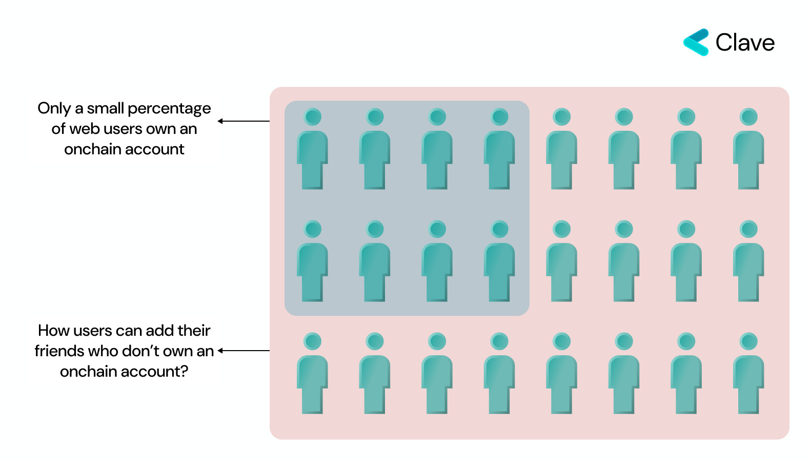
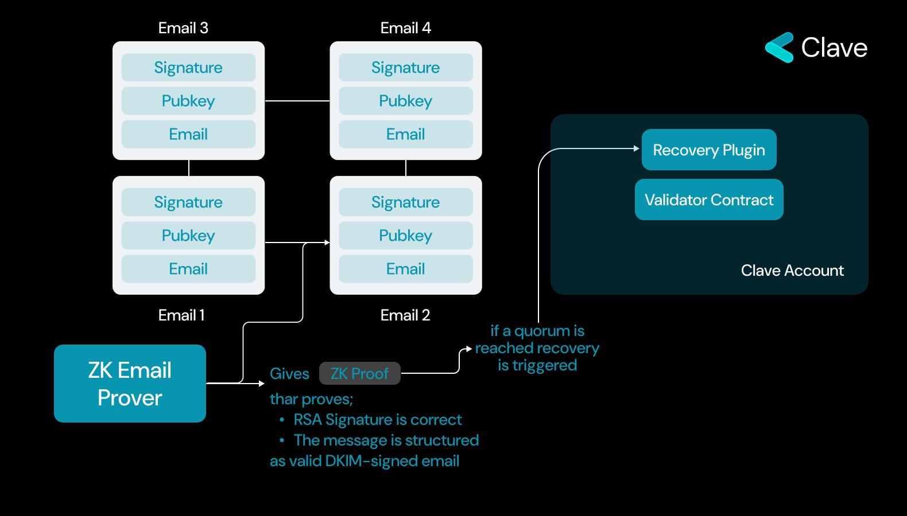
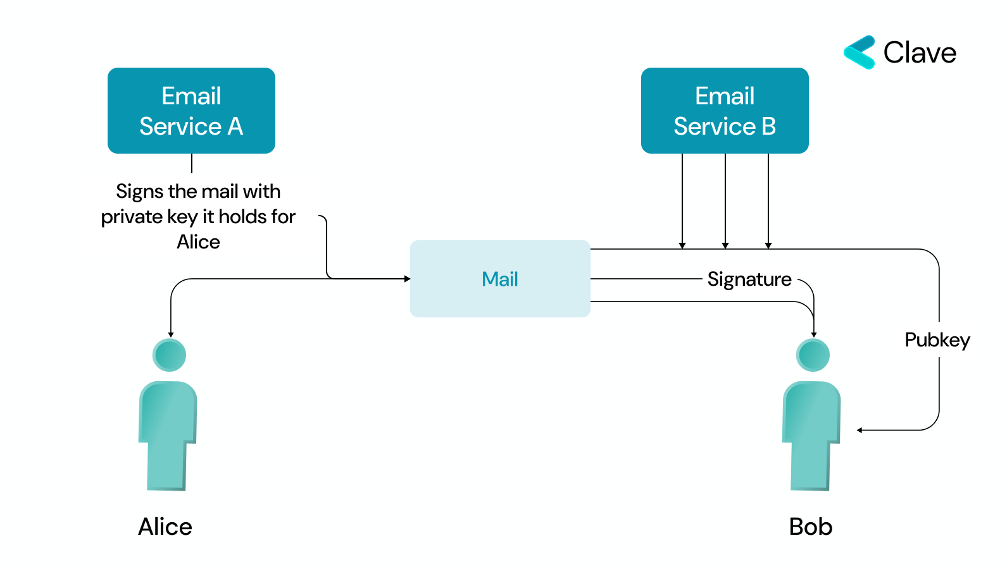
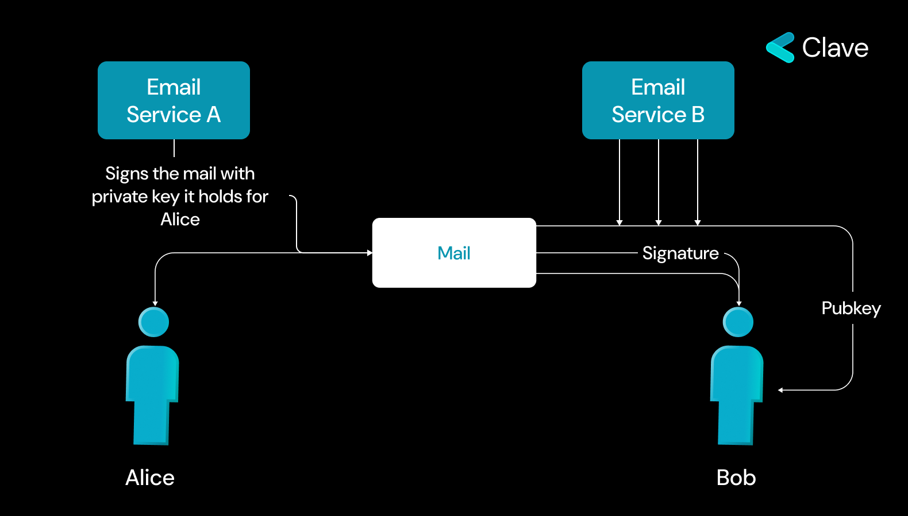

We are developing a recovery module for our smart contract infrascture. This mechanism employs passkeys for seamless onboarding and incorporates Universal Recovery for account recovery. A key feature of this system is the ability for users to appoint any of their friends with an email address as guardians, broadening the scope of accessible and secure account recovery options in our Clave wallet.

The basis of Universal Recovery is to authorize a specific email to initiate recovery with simply replying an Email from the relayer. We developed the Universal Recovery Module following the structure of Clave Module Contracts to make this possible. In short, this model keeps the emails that the user added as a guardian and ensures that the recovery can be initiated and executed by checking the zero-knowledge proof created by the relayer using the emails sent by the guardian. The user can add the email as guardian with just writing the guardian's Email address. After that the process of adding the recovery is completed. If the user loses access to the account for any reason, all that is required to recover the account again is for the guardian to reply an email to the relayer with the new public key in the subject of the email. Relayer can create a proof thanks to the incoming email and trigger the startRecovery function with this proof. In this way, the public key that allows the contract to be managed is changed and the user regains control of the account. So, how does ZK Email work?

## Introducing ZK-Email A Trusless Bridge Between Web2 Web3

**How Email Protocols are Working?**

Email protocols use DKIM for integrity assurance. This authentication method prevents email spoofing. DKIM employs an RSA key pair, similar yet distinct from Web3 key algorithms. The email sender's server uses a private key to generate a unique digital signature for each email, which is then attached to the email's header. The recipient's server uses the sender's public key, available in DNS records, to verify this signature. A matching signature confirms the email's authenticity and integrity, thus improving email security.

To enable this, each E-Mail has;

- Signature
- Message
- A Public Key

If we can verify this signature on blockchain, this can help us to generate an onchain account with only an E-Mail address and without any middleman. But verifying the DKIM directly onchain breaks the privacy and also RSA signature is not natively supported on blockchains, so verifying the RSA signature can also be expensive. This is why we need Zero Knowledge proofs to verify the DKIM onchain.

Each email includes a signature, message, public key, and the sender's address. When verifying the signature on the blockchain, the public key must be disclosed, potentially compromising privacy. This is because anyone examining the blockchain could see both the email address and the linked account address, creating a risk of personal information being exposed. Therefore, ensuring privacy while maintaining the integrity of email-based blockchain verification is a critical concern. With the ZKEmail protocol, proving that a message originates from a specific email address becomes possible onchain, enabling the creation of an onchain wallet directly linked to that email. This technique simplifies the process of integrating email-based identities with blockchain technology, ensuring both privacy and efficiency.

### How does it work?

Here's a simplified overview of what happens with the ZKEmail protocol:

1. Users sign a message with sending an email addresses.

2. The signed message, along with its signature and the public key, is sent to a prover.

3. The prover verifies the DKIM signature of the email and then generates a Zero Knowledge proof from this data.

4. This ZK proof is verified on the blockchain, establishing the email-based account identity for use.

Note that Clave's ZK-Email contracts are still under audit and not open sourced **yet**

